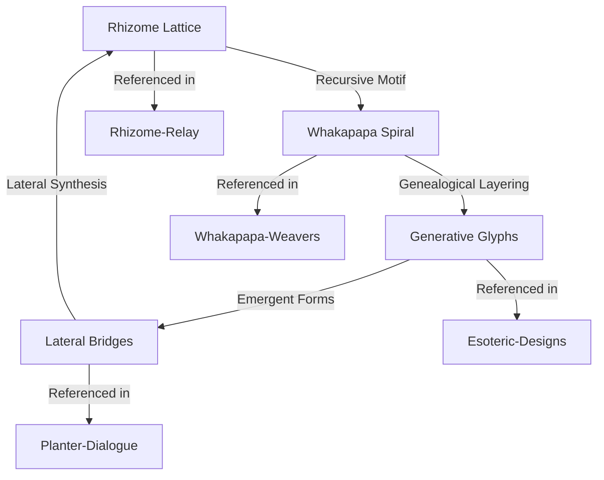

# Visual Motif Relationships (Mermaid)

This diagram shows the relationships and cross-references between the core visual motifs and their associated books.

- **A**: Rhizome Lattice (Rhizome-Relay, Forked-Paths, K-Mycelium)
- **B**: Whakapapa Spiral (Whakapapa-Weavers)
- **C**: Generative Glyphs (Esoteric-Designs, Druidic-Seedlings)
- **D**: Lateral Bridges (Planter-Dialogue, Plantlings)

This diagram can be expanded as new motifs and cross-book links are added.
